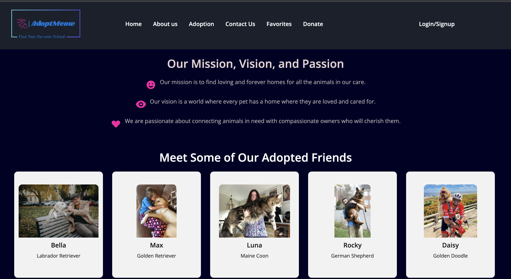

## 🐈 AdoptMeow 🐕

Look no further than AdoptMeow, the premier pet adoption page that connects you with your purr-fect companion! Whether you're a seasoned pet owner or a first-time adopter, AdoptMeow is here to make the adoption process a breeze and bring joy to your life through the magic of feline companionship. 


## 🚀 Demo 🚀


<!-- Insert gif or link to demo -->

## Table of Contents
- [Installation](#installation)
- [Usage](#usage)
- [Technologies Used](#technologies_used)
- [Contributing](#contributing)
- [Creating a Pull Request](#creating_a_pull_request)
- [Questions](#questions)

## 🛠️ Installation 🛠️

To run AdoptMeow locally, follow these steps:

1. Clone the repository to your local machine. 
```bash
git@github.com:brianlucla/Adopt-MEOW.git
```
2. Navigate to the Project Directory: Move into the project directory.
```bash
cd AdoptMeow
```
3. Install the project dependencies using npm (Node Package Manager).
```bash
npm install
```
4. Start the Development server: Run the development server to see the project in your browser.
```bash
npm run dev
```
5. Access the Application: Open your web browser and visit `http://localhost:3000` to access AdoptMeow.

[Back to Top](#table-of-contents)

## 🧐 Usage 🧐

Upon accessing AdoptMeow, you can:

- browse a list of available pets
- click on pet's card to view more details. 
- navigate between different pages using the provided navigation links. 
- favorite a pet.

## 💻  Technologies Used ⚙️

**Client:** 
- React: JavaScript library for building user interfaces.
- React Router DOM: Library for handling routing in React applications.
- React Player: Component for playing embedded videos.
- React Slick: Carousel component for displaying images and videos.


**Server:** 
- Node.js: JavaScript runtime environment.
- Express: Web application framework for Node.js.

<p align="left"> <a href="https://getbootstrap.com" target="_blank" rel="noreferrer">  </a> <a href="https://www.w3schools.com/css/" target="_blank" rel="noreferrer">  </a> <a href="https://expressjs.com" target="_blank" rel="noreferrer">  </a> <a href="https://git-scm.com/" target="_blank" rel="noreferrer">  </a> <a href="https://heroku.com" target="_blank" rel="noreferrer">  </a> <a href="https://developer.mozilla.org/en-US/docs/Web/JavaScript" target="_blank" rel="noreferrer">  </a> <a href="https://www.mongodb.com/" target="_blank" rel="noreferrer">  </a> <a href="https://www.mysql.com/" target="_blank" rel="noreferrer">  </a> <a href="https://nodejs.org" target="_blank" rel="noreferrer">  </a> <a href="https://reactjs.org/" target="_blank" rel="noreferrer">  </a> <a href="https://reactnative.dev/" target="_blank" rel="noreferrer">  </a> <a href="https://tailwindcss.com/" target="_blank" rel="noreferrer">  </a> </p>

## 🍰 Contributing 🍰

Contributions are always welcome!For major changes, please open an issue first
to discuss what you would like to change.

Please make sure to update tests as appropriate.

See `contributing.md` for ways to get started.

Please adhere to this project's `code of conduct`.

## Creating a Pull Request 

1. On GitHub.com, navigate to the main page of the repository.

2. In the "Branch" menu, choose the branch that contains your commits. Create your Feature Branch:
```
git checkout -b feature/"branch name"
```
 [github](https://camo.githubusercontent.com/ad4fb0c2b6981356e7af10cf6aeb536b3a613b94a16dabefaac653d82cd98265/68747470733a2f2f646f63732e6769746875622e636f6d2f6173736574732f63622d32393832352f6d772d313434302f696d616765732f68656c702f70756c6c5f72657175657374732f6272616e63682d64726f70646f776e2e77656270)

3. Above the list of files, in the yellow banner, click Compare & pull request to create a pull request for the associated branch.
[setup](https://camo.githubusercontent.com/99039f9908e514bf7e52e11e9bf61e718a583b40b130e69c871bd4850ed8ac22/68747470733a2f2f646f63732e6769746875622e636f6d2f6173736574732f63622d33343130362f6d772d313434302f696d616765732f68656c702f70756c6c5f72657175657374732f70756c6c2d726571756573742d636f6d706172652d70756c6c2d726571756573742e77656270)

4. Use the base branch dropdown menu to select the branch you'd like to merge your changes into, then use the compare branch drop-down menu to choose the topic branch you made your changes in.

5. Type a title and description for your pull request.

6. To create a pull request that is ready for review, click Create Pull Request. To create a draft pull request, use the drop-down and select Create Draft Pull Request, then click Draft Pull Request. For more information about draft pull requests, see "About pull requests."
7. Commit your changes:
```
git commit -m "Your commit message"
```
8. Push to the branch:
```
 git push origin feature/"branch name"
```
9. Open a Pull Request.

[Back to Top](#table-of-contents)

## Questions

If you have any questions or need further assistance with the Employee Tracker application, please feel free to reach out.

- Project Repository: [Link to Repository](https://github.com/brianlucla/Adopt-MEOW)
- Submit an Issue: [Project Issues](https://github.com/brianlucla/Adopt-MEOW/issues)
[Back to Top](#table-of-contents)

## Feedback

If you have any feedback, please reach out to us at 

[Back to Top](#table-of-contents)

## Authors

- [Brian](https://github.com/brianlucla)
- [Michelle](https://github.com/mvfranzke)
- [Merika](https://github.com/meeekkksss)
- [Matthew](https://github.com/MatthewGracia)

# React + Vite

- [@vitejs/plugin-react](https://github.com/vitejs/vite-plugin-react/blob/main/packages/plugin-react/README.md) uses [Babel](https://babeljs.io/) for Fast Refresh
- [@vitejs/plugin-react-swc](https://github.com/vitejs/vite-plugin-react-swc) uses [SWC](https://swc.rs/) for Fast Refresh

